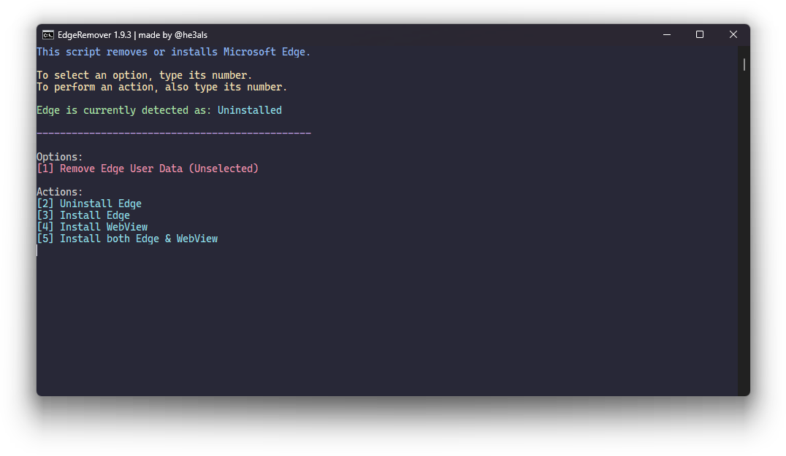

<p align="center">
  
</p>

<p align="center"><b>A PowerShell script that correctly uninstalls or reinstalls Microsoft Edge on Windows 10 & 11.</b></p>

---

### 🎉 Features

- Remove Edge with its own uninstaller, meaning there aren't leftovers, alongside no breakage as nothing is hardcoded
- Multiple fallback methods for uninstallation
- Can remove Edge installed with a `.msi`
- Ability to reinstall Edge and WebView2
- Implementable in scripts with parameters

### ⬇️ Usage
You can use the command below in PowerShell to launch the script. Alternatively, get the latest script from the [GitHub releases](https://github.com/he3als/EdgeRemover/releases/latest).

```powershell
iex(irm https://cdn.jsdelivr.net/gh/he3als/EdgeRemover@main/get.ps1)
```

<p align="center">
  
</p>

#### 📜 Implementation in Scripts

Download the script and run `Get-Help .\RemoveEdge.ps1` to see its options. You can either use the downloaded file directly with these arguments or put them into the snippet below:

```powershell
iex "&{$(irm https://cdn.jsdelivr.net/gh/he3als/EdgeRemover@main/get.ps1)} [ARGUMENTS HERE]"
```

<details>
  <summary>Example</summary>

  This would uninstall Edge, remove Edge's user-data, and install Edge WebView:
  ```powershell
  iex "&{$(irm https://cdn.jsdelivr.net/gh/he3als/EdgeRemover@main/get.ps1)} -UninstallEdge -RemoveEdgeData -InstallWebView"
  ```
</details>

### 🫧 Clearing Edge Blocks
You can use the command below in PowerShell to clear all EdgeUpdate policies, including those that block the reinstallation and update of Edge or WebView.

```powershell
iex "&{$(irm https://cdn.jsdelivr.net/gh/he3als/EdgeRemover@main/get.ps1)} -ClearUpdateBlocks"
```

### ❓ Troubleshooting

If Edge won't uninstall, try:

1. Repairing Edge
2. Making sure that Windows is up to date
3. Making sure that Edge is up to date

If it still doesn't work, [make an issue](https://github.com/he3als/EdgeRemover/issues).

### ✅ Additional Credits

- [Xyueta](https://github.com/Xyueta) - minor bug fixes
- [ave9858](https://gist.github.com/ave9858/c3451d9f452389ac7607c99d45edecc6) - inspired this script
- [h3r0](https://github.com/melo936) - notified me about the 'windir' method in the script
